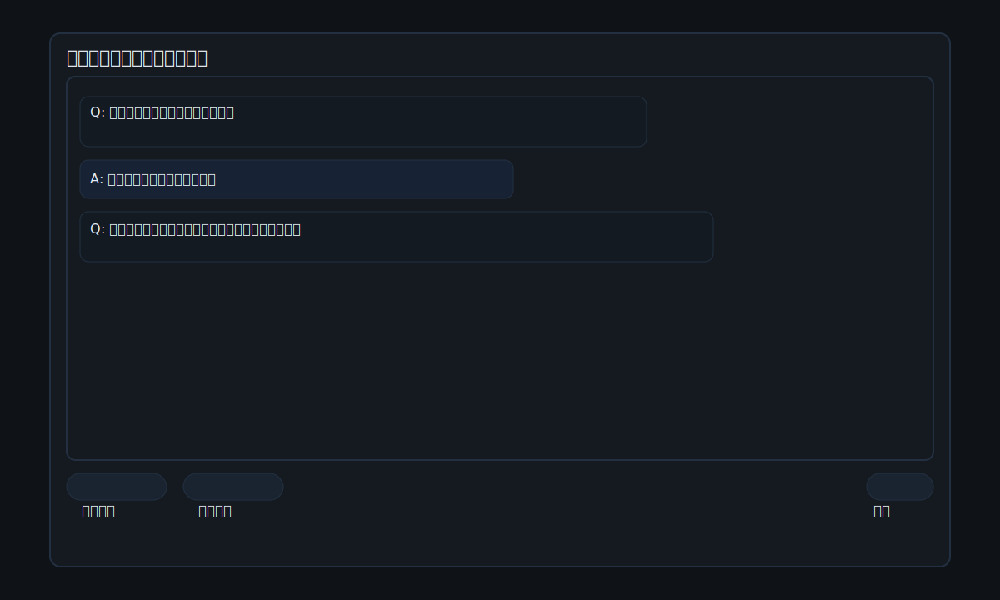

# Picture Diary (HTML/CSS/JS)

テキストを「日記」や「エッセイ」に整え、画像生成と音楽生成向けのプロンプトを作れる、静的なミニWebアプリです。ブラウザだけで動作します。

デモ: https://attrip.github.io/picture_diary/

## Screenshots

## Quick Start

- Serve the `src/` folder locally:
  - With Make: `make dev`
  - Or Python: `python3 -m http.server -d src 5173` then open http://localhost:5173

## Structure

- `src/` — static web app
  - `index.html` — page markup
  - `styles.css` — styles
  - `app/main.js` — UI glue code
  - `lib/prompt.js` — diary + image prompt generation logic
- `tests/` — simple browser-based tests
- `assets/` — placeholder for images or fonts

## Notes

- No build step; pure static assets.
- Prompts focus on clarity: subject, setting, mood, style, visual details, camera/lighting, quality tags.
- Language: UI is Japanese; generated prompt is bilingual (JP primary, EN helpers) to work well with many T2I models.

### Suno-style Music Prompts

- Added a simple music prompt generator with genre chips (J-POP, city pop, lo-fi, trap, R&B, rock, etc.).
- Generates a structured prompt plus small lyric ideas for singing or rap in Japanese/English.

### Meta, Icons, and Social

- Head meta: description, canonical, Open Graph/Twitter, theme-color, PWA basics.
- Icons:
  - Favicon/Safari pinned: `src/assets/icon.svg`, `src/assets/mask-icon.svg`
  - Manifest: `src/site.webmanifest` (SVG icon; PNG推奨の場合は `512x512` と `192x192` を追加してください)
  - Apple Touch Icon: 180x180 PNG を `src/assets/apple-touch-icon.png` に配置すると有効化されます。
- OG画像:
  - 現状は GitHub のリポジトリOGを暫定使用。
  - 独自の `src/assets/og-image.jpg` (1200x630) を用意して、`index.html` の `og:image` を差し替えてください。

## これは何？（ブログ風の紹介）

「Picture Diary」は、思いついた言葉を放り込むだけで、日記調に整った文章と、画像生成サービスで使える“伝わるプロンプト”を同時に用意してくれる小さな道具です。さらに、Suno などの音楽系サービスで使える“音楽プロンプト”も一緒に作れます。

ポイントは3つ。

1) 書くのを助ける「チャットモード」
- エッセイ/日記に合わせた質問を順番に投げ、あなたの答えを下の入力ボックスに自動でまとめます。
- Enter は改行、Ctrl/⌘+Enter で送信。変換中の Enter は無視するので誤送信しにくい。
- 「取り消し」ボタンや Ctrl/⌘+Z で一手前に戻せます。入力欄は固定で、スクロールしても送信位置が動きません。

2) 画像生成の“通る”プロンプトを出力
- スタイル（例: 水彩、マンガ、油絵、写真風、浮世絵、レトロアニメ、ドット絵、3Dプリンターパターン など）と雰囲気（mood）を選ぶだけ。
- 日本語＋英語の二言語で出力。被写体、雰囲気、スタイル、構図、ディテール、品質タグを、短い項目でカンマ区切りに並べます。
- 文字は“イメージ作成の参考”で、画像内には描かせない方針がデフォルト。必要なときだけ小さなタイトル（1行目）を許可できます。
- ワンクリックで ChatGPT / Gemini に移動して、すぐ続きを試せます。

3) Suno 風の音楽プロンプトも作れる
- ジャンル（City Pop, Lo-fi, Trap, R&B, Rock, Acoustic, EDM, Jazz, Bossa…）や雰囲気、ボーカル（歌/ラップ/ミックス）、言語、テンポを選択。
- Rap/Reggae/Dub/Jungle の“カスタムプリセット”を用意。さらにチップから自作プリセットを追加できます。
- 歌詞トーン（内省的/詩的/口語的/力強い/ユーモア/物悲しい/ロマンチック/前向き/物語調/ミニマル）を表示。短いサビ/フック/ラップのアイデアも出力します。
- 出力フォーマットは「カンマ＋半角スペース」で読みやすく、コピペに強い形。

## 使い方（かんたん3ステップ）

1) チャットに答える or 上の入力欄に自由に書く
- エッセイ/日記を選んで、質問に答えると、文章が自動でまとまります。

2) オプションを選ぶ
- 画像: スタイル、雰囲気、アスペクト比、ディテール、文字表示ポリシー（基本は文字なし）
- 音楽: テーマ、ジャンル（チップからも選択）、雰囲気、ボーカル、言語、トーン、テンポ

3) 生成してコピペ
- 「日記とプロンプトを生成」「音楽プロンプトを生成」→ コピー。
- 必要なら「ChatGPTで開く」「Geminiで開く」でタブを開き、貼り付けて続きへ。

## ちょっとした工夫（こだわり）

- チャット入力は複数行、Enterは改行、Ctrl/⌘+Enter送信、IME中Enter無視。
- 「取り消し」＆ Ctrl/⌘+Z で一手戻る。入力欄は固定でレイアウトが動かない。
- コピー時はボタン色のみ変化（テキストはそのまま）で、リズムを崩さない。
- 画像プロンプトは日本語+英語の短い項目をカンマ区切りで並べ、無駄に長くしない。
- 文字は基本描かない方針（ノイズ低減）。必要時のみ小さく控えめに。

## よくある質問（FAQ）

- Pages が 404 になる場合？
  - 初回は数分待つ。Actions の `Deploy static site to GitHub Pages` の成功を確認。
  - Settings → Pages → Source が「GitHub Actions」か確認。

- OG画像やアイコンを変えたい
  - `src/assets/og-image.jpg` を置き、`index.html` の `og:image` を差し替え。
  - アイコンは SVG を同梱。PNG を使う場合は `src/assets/apple-touch-icon.png` などを追加し、`index.html` の `<link>` を編集。

- スタイルや雰囲気を増やしたい
  - `src/lib/prompt.js` の `stylePreset`/`moodPreset` に項目を追加します。

- 音楽のジャンルを増やしたい
  - 画面の「＋ プリセットを追加」から登録、または `MusicPrompt.addGenre(key, { jp, en, instr, bpm })` を使います。

---

何か気になる点や「このスタイルを入れたい」「このジャンルの歌詞アイデアを強化したい」などあれば、Issue で気軽にどうぞ！

## Roadmap

- Add presets for style (watercolor, manga, oil paint, photo)
- Provide seed control and negative prompt suggestions
- Optional API integration for on‑page image generation
